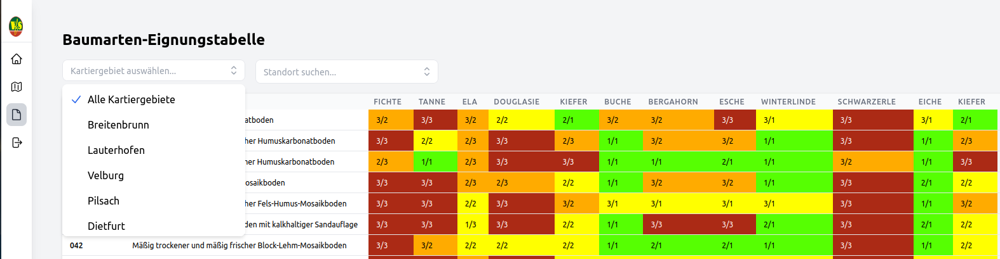
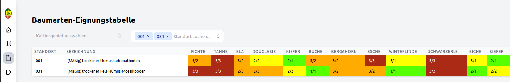

# Baumarteneignungstabelle

Für alle Benutzer des VfS Viewer Plus stehen in diesem Bereich die Baumarteneignungstabellen zur Verfügung.

Die Tabelle kann:

\- Datensätze von allen oder von einzelnen Kartiergebieten zeigen. Im Fenster “Kartiergebiet auswählen“ kann die jeweilige Auswahl getroffen werden

\- Standorte Filtern. Im Fenster “Standort suchen“ können einzelne Standorte gesucht und ausgewählt werden (z.B. 031).

Mit der Funktion PDF Export und Excel Export kann die  Baumarteneignungstabelle in diese beiden Formate exportiert werden.
