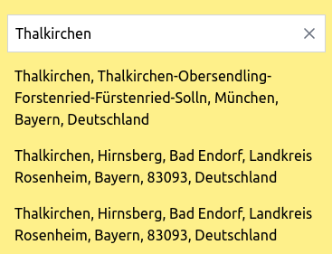
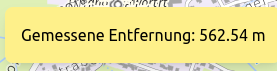
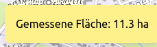
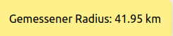
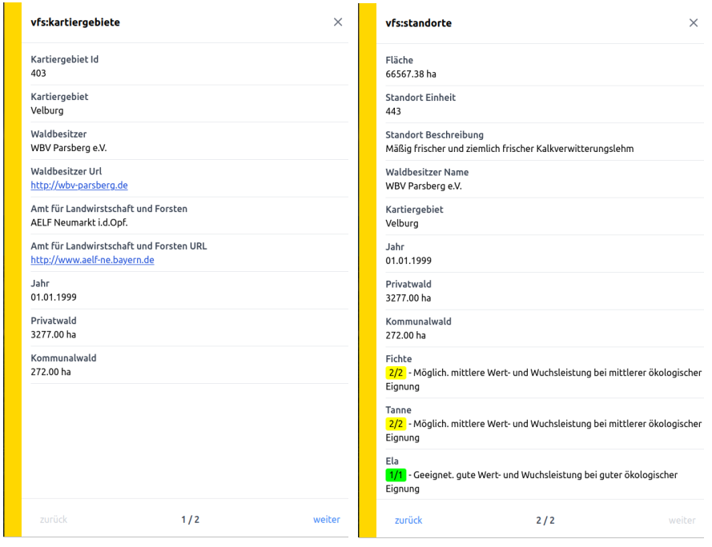
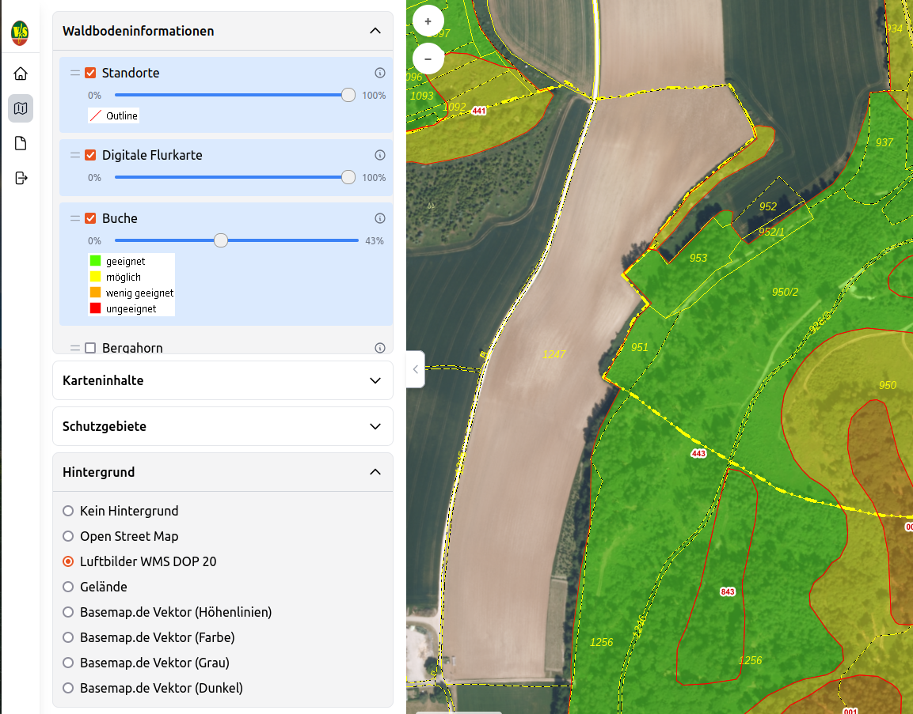

# Karte

Die +/- Pfeiltasten können für die Navigation innerhalb der Karte verwendet werden.
Die Werkzeugleiste wird auf der rechten Seite dauerhaft eingeblendet. Im Folgenden werden die Funktionen (von oben nach unten) im Detail beschrieben:

- Zeige gesamte Karte: die Gesamtausdehnung der Karte wird angezeigt.

- Adresse suchen: Ein gewünschtes Gebiet kann mit Hilfe einer integrierten Suchfunktion schnell gefunden werden. Es ist möglich entweder nach einer kompletten Adresse zu suchen oder nach Postleitzahl, Ortsteil, Straße oder Gemeinde.

- Hilfe Dokument: Hierauf haben Sie geklickt, um dieses Dokument zu erhalten.

- Zurück zur vorherigen Ansicht: Mit Klick auf diesen Button wird auf den zuvor gewählten Zoomausschnitt gezoomt.

- Kartenausschnitt vergrößern: Ziehen Sie ein Rechteck mit der Maus auf und vergrößern Sie damit den Kartenausschnitt.

- Entfernung messen: Damit können Abstände auf der Karte gemessen und in m oder km ausgegeben werden. Hierfür setzt man mit der linken Maustaste den Anfangspunkt und weitere Punkte der Messung. Der Endpunkt wird mit Doppelklick gesetzt, woraufhin das Ergebnis in einem extra Fenster (am oberen Bildschirmrand) dargestellt wird:

- Fläche messen: Mit diesem Werkzeug lässt sich z.B. die Waldfläche einfach ermitteln. Nach Auswahl dieser Option und einfachem Klick in die Karte (Startpunkt der Fläche) erscheint eine Linie, mit der die Fläche abgegriffen werden kann. Mit Doppelklick wird die Fläche (in ha oder km²) berechnet und in einem extra Fenster (am oberen Bildschirmrand) dargestellt.

- Radius messen: Mit Klick in die Karte, können Sie einen Radius aufziehen, der mit Doppelklick den gemessenen Wert am oberen Bildschirmrand ausgibt.

- Rauminformationen: Hier wird Information zu den Waldflächen die durch den VfS kartiert wurden in einem extra Fenster dargestellt (z.B.: Name des Kartiergebietes, Waldbesitzer). Im authentifizierten Bereich können auch die verschiedenen Informationen zu den Standorten abgerufen werden.

- PDF erzeugen: Damit kann ein gewünschter Ausschnitt (z.B. ein bestimmtes Kartiergebiet) in einem PDF-Dokument ausgegeben werden, um dies z.B. an eine andere Person weiterzugeben oder auf Papier zu drucken. Mit Aufruf dieser Funktion wird eine Druckansicht mit dem gewählten Kartenausschnitt und den derzeit aktiven Kartenthemen dargestellt. Gehen Sie anschließend auf “PDF erstellen“, woraufhin die Seite als pdf-Datei ausgegeben wird.

# Kartenanzeige/Legende

Dieser Bereich bietet in Form einer Legende das zur Verfügung stehende Kartenmaterial des VfS Viewers an. Mit einfachem Klick auf die Hauptüberschriften “Waldbodeninformationen“, “Kartendaten“, “Schutzgebiete“ und “Hintergrund“ werden die Gruppen geöffnet und es können dort die entsprechenden Themen zu-/abgeschaltet werden.  

Mit gedrückter linker Maustaste am Anfang des Layers, können die Ebenen individuell platziert werden: z.B. “Buche“ oben, danach “Fichte“, etc.

Mit dem Schieberegler kann jeder Layer transparent dargestellt werden.

Das Informationsmaterial ist in vier Gruppen unterteilt (die Informationen werden dargestellt, wenn die Checkbox des Layers aktiviert wird):

- **Waldbodeninformationen**: Diese Ebenen sind nur im VfS Viewer Plus enthalten. Nach erfolgter Anmeldung können die Layer dieser Gruppe betrachtet werden. In diese Gruppe können die VfS Standorte, die Baumarteneignungen für verschiedene Baumarten (z.B. Fichte, Buche, Tanne, etc.) sowie die amtlichen Flurkarten betrachtet werden.

Die Standortflächen sind mit der jeweiligen Kartiereinheit beschriftet. 	

Die Baumarteneignung ist in 4 Klassen unterteilt 
- rot = ungeeignet
- orange = wenig geeignet
- gelb = möglich
- grün = geeignet. 
 
Die konkreten Eignungscodes zu einer Kartiereinheit lassen 	sich durch einen Klick mit dem Werkzeug “Rauminformationen“  in einem separaten Fenster darstellen.

Die Lizenz zur Nutzung der Digitalen Flurkarte hat der Verein für forstliche Standorterkundung für 	den internen Bereich käuflich erworben. Die Darstellung der Digitalen Flurkarte ist erst ab einem be	stimmten Zoom-Maßstab möglich, weshalb die Ansicht im VfS Viewer vergrößert werden muss.

- **Karteninhalte**: In diesem Bereich werden Verwaltungsgrenzen und die VfS Kartiergebiete dargestellt.

- **Schutzgebiete**: Trinkwasserschutzgebiete, Landschaftsschutzgebiete, Naturschutzgebiete, Fauna-Flora-Habitat, Vogelschutzgebiete und Naturparke

- **Hintergrund**: Hintergrundkarten, wie z.B. Open Street Map, Luftbilder WMS DOP 20, basemaps.de, etc. oder kein Hintergrund kann gewählt werden. 
